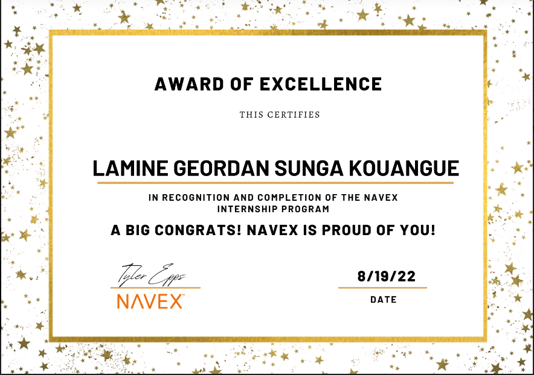

# Summer 2022 Internship-Navex

## Takeways and Experiences

### Octopus-as-Code with Terraform Templates
Convert deployment pipelines into IaC using Terraform templates
CI/CD pipelines co-exist with application code
Technologies: Octopus Deploy, Terraform, Containers.

### Checkmarx CxFlow project
Perform static code analysis/security scanning at lowest level in SDLC
Technologies: Checkmarx, GitHub, AWS ECS/Fargate, Containers.

### AWS Build Selenium Report Parser
Streamline automated testing by parsing out relevant error data from AWS S3 and pushing relevant error messages to Slack
Technologies: Python, AWS Lambda, AWS Cloudformation, AWS Codebuild, Slack API.

#### Mentorship Experience and Weekly Stand-up 

